  
# 👋 ¡Hola! Soy Julián Gómez Brizuela

  

---

## 🚀 Sobre Mí

Soy **Julián Gómez Brizuela**, Ingeniero Comercial con especialización en **Ciencia de Datos, Machine Learning e Inteligencia Artificial**. Mi pasión es transformar datos complejos en insights estratégicos que impulsan la toma de decisiones empresariales.

### 💼 Experiencia Profesional

Actualmente lidero proyectos en **DataStudio** ([www.datastudio.cl](http://www.datastudio.cl)), donde combinamos visión de negocio con tecnología avanzada para crear soluciones basadas en datos que generan valor real. Mi experiencia abarca:

- 📊 **Análisis de Datos:** Extracción de insights accionables mediante técnicas estadísticas avanzadas
- 🤖 **Machine Learning:** Desarrollo e implementación de modelos predictivos y de clasificación
- 🧠 **Inteligencia Artificial:** Soluciones con NLP, Computer Vision y modelos generativos
- 💻 **Desarrollo Full Stack:** Creación de aplicaciones y dashboards interactivos
- 📈 **Business Intelligence:** Visualización de datos y KPIs para decisiones estratégicas

### 🎯 Mi Enfoque

Creo firmemente en el poder de los datos para transformar negocios. Mi formación como Ingeniero Comercial me permite entender profundamente los problemas empresariales, mientras que mi expertise técnico me da las herramientas para resolverlos de manera innovadora y escalable.

### 🎓 Formación & Certificaciones

- **Ingeniero Comercial** 
- **Especialidad en Ciencia de Datos** - Talento Digital para Chile
- **Especialidad en Análisis de Datos** - Talento Digital para Chile

### 📍 Ubicación

Santiago, Chile 🇨🇱

---

## 🛠️ Tecnologías y Herramientas

### 💻 Lenguajes

### 🤖 Data Science & AI/ML

### 📊 Análisis & Visualización

### 🔧 Herramientas

---

## 🎓 Áreas de Especialización

<table>
<tr>
<td align="center" width="25%">

 <b>Análisis de Datos</b>
 

• Estadística Avanzada 
• Limpieza de Datos 
• EDA & Insights 
• Visualización

</td>
<td align="center" width="25%">

 <b>Ciencia de Datos</b>
 

• Modelado Predictivo 
• Feature Engineering 
• A/B Testing 
• Big Data Analytics

</td>
<td align="center" width="25%">

 <b>Machine Learning</b>
 

• Supervised Learning 
• Unsupervised Learning 
• Ensemble Methods 
• Model Optimization

</td>
<td align="center" width="25%">

 <b>Inteligencia Artificial</b>
 

• Deep Learning 
• NLP & LLMs 
• Computer Vision 
• Neural Networks

</td>
</tr>
</table>

---

## 🎓 Certificaciones Profesionales

<table>
<tr>
<td align="center" width="50%">

 
<b>Talento Digital para Chile</b>
 

</td>
<td align="center" width="50%">

 
<b>Talento Digital para Chile</b>
 

</td>
</tr>
</table>

✅ Credenciales verificables oficialmente en Acreditta

---

## 💼 Perfil Profesional

```mermaid
mindmap
  root((Julián Gómez<br/>Ingeniero Comercial))
    Business Strategy
      Análisis de Mercado
      Toma de Decisiones
      KPIs & Métricas
      ROI Optimization
    Data Science
      Python & R
      Statistical Analysis
      Data Mining
      Predictive Analytics
    Machine Learning
      Supervised Models
      Unsupervised Models
      Deep Learning
      Model Deployment
    AI Development
      NLP Applications
      Computer Vision
      LLM Integration
      AI Strategy
```

---

## 📊 Estadísticas de GitHub

  

  

---

## 🎯 Proyectos Destacados

<table>
<tr>
<td width="50%">

### 🎁 Amigo Secreto

Proyecto interactivo desarrollado durante el curso Oracle. Implementa lógica de asignación aleatoria para el juego del amigo secreto.

**Tech:** CSS, JavaScript, HTML

</td>
<td width="50%">

### 🛒 Alura Store Challenge

Proyecto de Data Science utilizando Python. Análisis y visualización de datos con Jupyter Notebooks.

**Tech:** Python, Jupyter Notebook, Pandas

</td>
</tr>
<tr>
<td width="50%">

### 🎓 Skillnest Repository

Repositorio de recursos y materiales educativos del proyecto Skillnest.

</td>
<td width="50%">

### 🤖 Synthema IA Qwen

Implementación de IA utilizando el modelo Qwen 3 32b para aplicaciones PHP.

**Tech:** PHP, AI/ML

</td>
</tr>
</table>

---

## 📈 Actividad Reciente

<!--START_SECTION:activity-->
<!--END_SECTION:activity-->

---

## 🤝 Conecta Conmigo

¿Tienes un proyecto en mente? ¿Quieres colaborar? ¡No dudes en contactarme!

---

  
### 💭 Cita del Día

---

  
**⭐ Si te gusta mi trabajo, considera darle una estrella a mis repositorios ⭐**

---

  
### 🎯 Objetivos 2025

- [ ] 🚀 Contribuir a proyectos Open Source de ML/AI
- [ ] 📚 Publicar papers o artículos sobre Data Science
- [ ] 🤖 Desarrollar soluciones de IA generativa
- [ ] 🌟 Crear cursos sobre Machine Learning
- [ ] 💼 Expandir DataStudio con proyectos de IA empresarial
- [ ] 🎓 Certificaciones avanzadas en Cloud AI (AWS/GCP/Azure)

---

  

